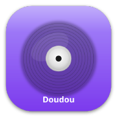

# 🎵 Doudou - Jellyfin Music Player

A beautiful, privacy-focused music player for your personal Jellyfin media server.


Note: Icon is planned to be changed once someone makes a new one this is just so there is one in place and as a refernce.

```

## ✨ Features

- 🎵 **Beautiful Interface** - Clean, intuitive design inspired by modern music apps
- 🔒 **Privacy First** - Zero data collection, no analytics, no tracking
- 🌐 **Full Jellyfin Integration** - Browse albums, artists, playlists, and songs
- 🎧 **Advanced Audio** - Smart crossfade, gapless playback, and 10-track preloading
- 📱 **Background Playback** - Keep your music playing while using other apps
- 📋 **Queue Management** - Add, remove, and reorder tracks in your queue
- ⭐ **Favorites** - Mark and easily access your favorite tracks
- 🔄 **Smart Controls** - Intelligent skip-to-previous behavior
- 📦 **Offline Ready** - Automatic caching for smooth playback

## 🚀 Getting Started

### Prerequisites
- Personal Jellyfin media server (version 10.8+)
- Android device (5.0+ / API level 21)
- Network connection to your Jellyfin server

### Installation
1. Download from Google Play Store *(coming soon)*
2. Open Doudou and enter your Jellyfin server details
3. Login with your Jellyfin credentials
4. Start enjoying your music!

## 🔒 Privacy & Data

**We collect NO data whatsoever.**
- No personal information
- No usage analytics  
- No crash reporting to external services
- No advertising or tracking
- Your music stays between you and your server

All data (server settings, preferences) stays locally on your device.

## 🛠️ Development

### Building from Source

```bash
# Clone the repository
git clone https://gitlab.com/httpanimations/doudou.git
cd doudou

# Install dependencies
flutter pub get

# Run in development
flutter run

# Build debug APK
make android

# Build release APK (debug signed)
flutter build apk --release
```

### Android Release Signing

For production builds and Google Play Store:

```bash
# 1. Generate a keystore (one-time setup)
make generate-keystore

# 2. Create environment setup script
make setup-signing

# 3. Edit setup-signing.sh with your actual passwords
nano setup-signing.sh

# 4. Load environment variables
source setup-signing.sh

# 5. Build signed APK
make android-signed

# 6. Build App Bundle for Play Store
make android-bundle
```

**Environment Variables Required:**
- `KEYSTORE_PASSWORD` - Password for the keystore file
- `KEY_PASSWORD` - Password for the signing key
- `KEY_ALIAS` - Alias name for the signing key (default: 'doudou')
- `KEYSTORE_PATH` - Path to keystore file (default: 'android/app/key.jks')

**Security Note:** Never commit signing files or passwords to version control. The keystore file and setup script are automatically excluded via `.gitignore`.

### Release Preparation

For Google Play Store release preparation:

```bash
# Generate release keystore
./scripts/generate-keystore.sh

# Build app bundle for Play Store
flutter build appbundle --release
```

See [Release Checklist](docs/release-checklist.md) for complete Play Store submission guide.

## 📋 Play Store Information

### Data Safety
✅ **This app does NOT collect any user data**
- No personal information
- No financial data
- No location data  
- No device identifiers
- No usage analytics

### Permissions
- **Internet** - Connect to your Jellyfin server
- **Network State** - Check connection status
- **Wake Lock** - Keep music playing in background
- **Foreground Service** - Background audio playback

### Content Rating
- **Everyone** - No objectionable content
- Music streaming app for personal media libraries

## 🤝 Contributing

We welcome contributions! Please follow the code style and test code before commiting.

### Development Setup
1. Fork the repository
2. Create a feature branch
3. Make your changes
4. Test thoroughly
5. Submit a pull request

## 📝 Legal

- [Privacy Policy](docs/privacy-policy.md)
- [Terms of Service](docs/terms-of-service.md)
- [Data Safety Information](docs/data-safety-info.md)

## 📞 Support

- **Issues:** [GitHub Issues](https://gitlab.com/httpanimations/doudou/issues)
  
## 🙏 Acknowledgments

- [Jellyfin Project](https://jellyfin.org/) - Amazing open-source media server
- [Flutter Team](https://flutter.dev/) - Excellent mobile development framework
- [just_audio](https://pub.dev/packages/just_audio) - Reliable audio playback
- [audio_service](https://pub.dev/packages/audio_service) - Background audio support

## 📄 License

This project is licensed under the GNU License - see the [LICENSE](LICENSE) file for details.

---

**Made with ❤️ for the Jellyfin community**

*Self-hosted music, beautifully presented*
