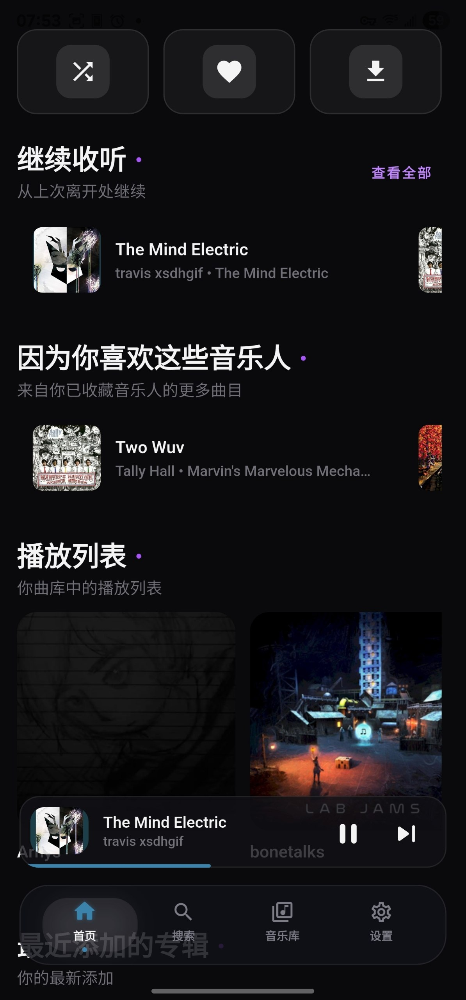
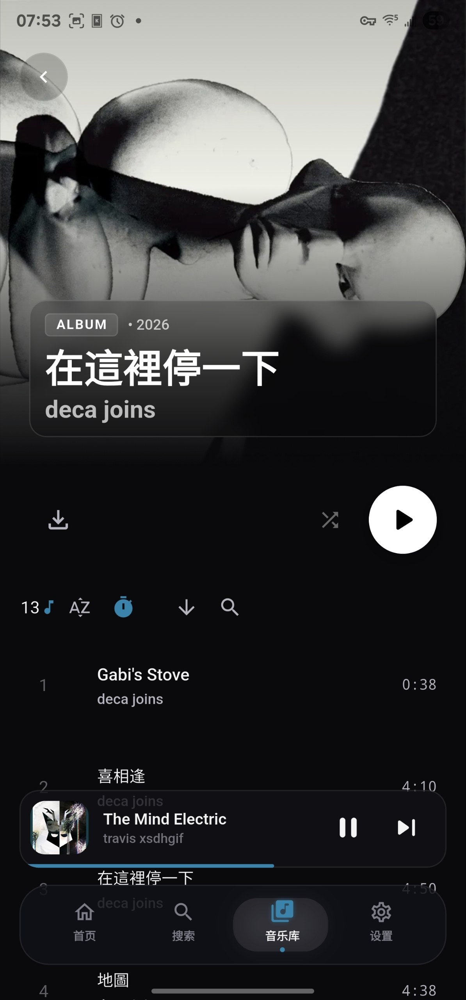
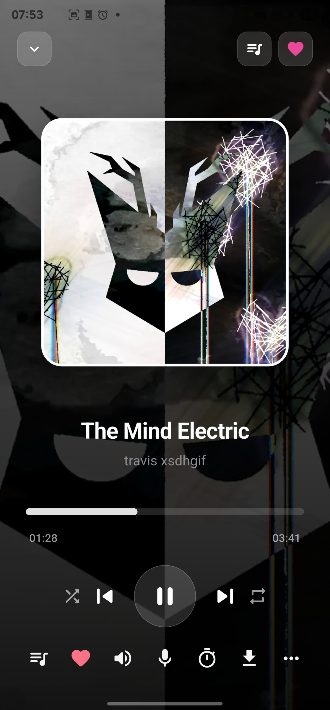
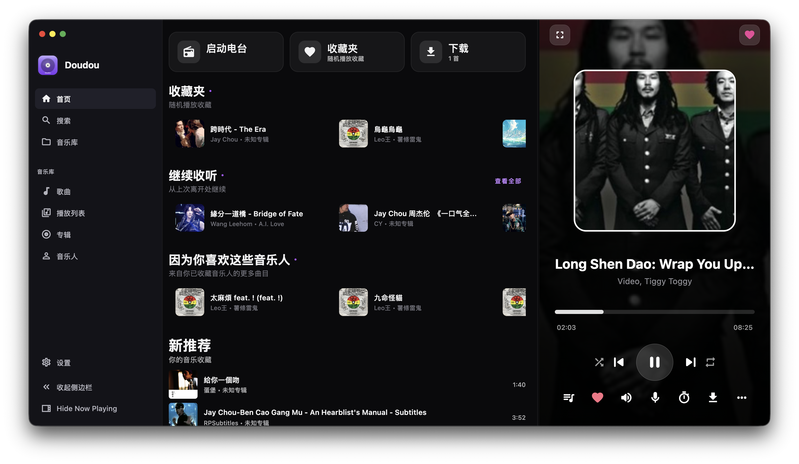

# Doudou

A music player that connects to your own media server. Stream your library, or pull from YouTube Music

<p align="center">
  
  
  
</p>

<p align="center">
  
</p>

## What it connects to

- **Subsonic** / **OpenSubsonic** - Best tested and recommended
- **YouTube Music** - Full support (disabled in Play Store build for compliance with Google's policies)
- **Jellyfin** - Supported, minor bugs possible
- **Plex** - Works, but less tested. File an issue if you hit problems

## What it does

- Gapless playback with a proper queue and history
- Background audio on mobile and desktop
- Download songs, albums, and playlists for offline listening
- Lyrics support (synced and static)
- Radio mode that keeps the music going
- Automatic transcoding when your server supports it
- System media controls
- Android Auto support
- Wear OS companion app with playback controls, shuffle, and favorites
- Android TV support with D-pad navigation and 10-foot UI
- Discord Rich Presence on desktop (show what you're listening to)
- Dynamic themes pulled from album artwork

## Platforms

Android, Android TV, Wear OS, iOS, macOS, Windows and, Linux

## Download

Get builds for every platform at **[openlyst.ink/apps/doudou](https://openlyst.ink/apps/doudou)**.

Nightly builds are also available on **[GitLab Releases](https://gitlab.com/Openlyst/doudou/-/releases)**. Android APKs are signed with a debug key — enable installs from unknown sources to install them. iOS and macOS builds are unsigned and must be signed locally before installing.

## Quick start
1. Open the app and hit "Add Server"
2. Pick your backend type (Youtube Music is turned off for Playstore versions)
3. Log in

## FAQ

**Can I use this outside my house?**

Yes, as long as your server is reachable from the internet. A reverse proxy or VPN is a good idea.

**How do downloads work?**

Long-press anything (song, album, playlist) and choose download. It lives in the app, not your public downloads folder.

**Is the desktop UI different?**

Same app, same backend. The layout adapts to screen size. 

## Compile

You need the Flutter SDK (3.35.0 or newer).

```bash
git clone https://gitlab.com/Openlyst/doudou.git
cd doudou
flutter pub get
```

### Linux desktop extra dependency
Appindicator headers are needed on Debian/Ubuntu:

```bash
sudo apt-get install -y libayatana-appindicator3-dev
```

### Build commands

The Android app uses product flavors — `phone` for the main app, `wear` for the Wear OS companion, and `tv` for Android TV.

```bash
# Android (phone)
flutter build apk --release --flavor phone -t lib/main.dart
flutter build appbundle --release --flavor phone -t lib/main.dart

# Android (phone — Play Store)
flutter build apk --release --flavor phone --dart-define=PLAYSTORE=true -Pplaystore=true -t lib/main.dart
flutter build appbundle --release --flavor phone --dart-define=PLAYSTORE=true -Pplaystore=true -t lib/main.dart

# Android (Wear OS)
flutter build apk --release --flavor wear -t lib/main_wear.dart

# Android (TV — YouTube Music disabled)
flutter build apk --release --flavor tv --dart-define=PLAYSTORE=true --dart-define=TV=true
flutter build appbundle --release --flavor tv --dart-define=PLAYSTORE=true --dart-define=TV=true

# Android (TV — YouTube Music enabled)
flutter build apk --release --flavor tv --dart-define=PLAYSTORE=false --dart-define=TV=true
flutter build appbundle --release --flavor tv --dart-define=PLAYSTORE=false --dart-define=TV=true

# iOS
flutter build ipa --release

# Desktop
flutter build windows --release
flutter build macos --release
flutter build linux --release
```

## Issues and contributing

Bugs and feature requests go in the [issue tracker](https://gitlab.com/Openlyst/doudou/issues). Pull requests are welcome.

## License

[GPL-3.0](LICENSE)

## Acknowledgements

Doudou (version 16.0.0 and later) is based on [Harmony-Music](https://github.com/anandnet/Harmony-Music) by anandnet.
